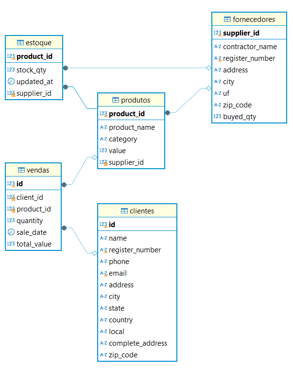

# Teste para Analista de Dados - Setup Tecnologia 2025

## 📌 Objetivo

Este projeto tem como finalidade demonstrar minhas habilidades técnicas e analíticas na criação de uma solução de análise de dados. O foco está em processos de ETL, modelagem de dados, conexão com Power BI e análise exploratória.

## 🛠️ Tecnologias Utilizadas

#### Banco de Dados: MySQL

#### Ferramenta de Visualização: Power BI

#### Linguagem de desenvolvimento: Python

#### Versionamento: GitHub

## 📂 Estrutura do Projeto

```
📦 MeuProjeto
├── 📁 BASES
   ├── Clientes.csv
   ├── Estoque.csv
   ├── Fornecedores.csv
   ├── Produtos.csv
   └── Vendas.csv
├── 📁 TRATADOS
   ├── Clientes_tratado.csv
   ├── Estoque_tratado.csv
   ├── Fornecedores_tratado.csv
   ├── Produtos_tratado.csv
   └── Vendas_tratado.csv
├── 📁 scripts
   ├── .env
   ├── main.ipynb
   ├── setup_mysql_database.py
   └── import_data.py
├── 📁 dashboard
   ├── 📁 imagens
      ├── clientes.png
      ├── estoque.png
      ├── fornecedor.png
      └── vendas.png
   ├── novas_colunas_powerbi.txt
   └── Dashboard.pbip
├── requirements.txt
└── 📄 README.md
```
## 🔄 Fluxo de trabalho

#### 📥 Passo 01 - download de pré-requisitos 
Inicialmente deve-se baixar todas as bibliotecas necessárias utilizando o comando:
```
pip install requirements.txt
```

#### 🔧 Passo 02 - ETL
- Os dados foram obtidos do github fornecido e salvos em: ./BASES

- Foi desenvolvido um notebook python com todos os passos necessários para a ETL dos dados:
 ```
 ./scripts/main.ipynb
 ``` 

- Por fim, as planilhas tratadas foram salvas em: ./TRATADAS

#### 🏦 Passo 03 - banco de dados MySQL
- OBS. Antes de tudo, será necessário configurar as informações presentes em: .env
- O banco de dados, juntamente com as tabelas pode ser criado usando:
```
python ./scripts/setup_mysql_database.py
```

- A importação dos dados pode ser realizada usando:
```
python ./scripts/import_data.py
```



#### 📊 Passo 04 - Conexão com Power BI

- Foi criada a conexão para a análise interativa.

- Novas colunas foram criadas internamente no Power BI, estando documentadas em: ./dashboard/novas_colunas_powerbi.txt

- Foram desenvolvidas então 4 telas para visualização dos resultados no Power BI, sendo elas: Vendas, Estoque, Clientes e Fornecedores. O dshboard foi disponibilizado em DBIP.

#### 🚀 Passo 05 - Deploy e Compartilhamento 
- Foi realizado o upload do projeto neste GitHub.


#### Créditos:
- Esse projeto foi desenvolvido por Cleber Furtado Aksenen